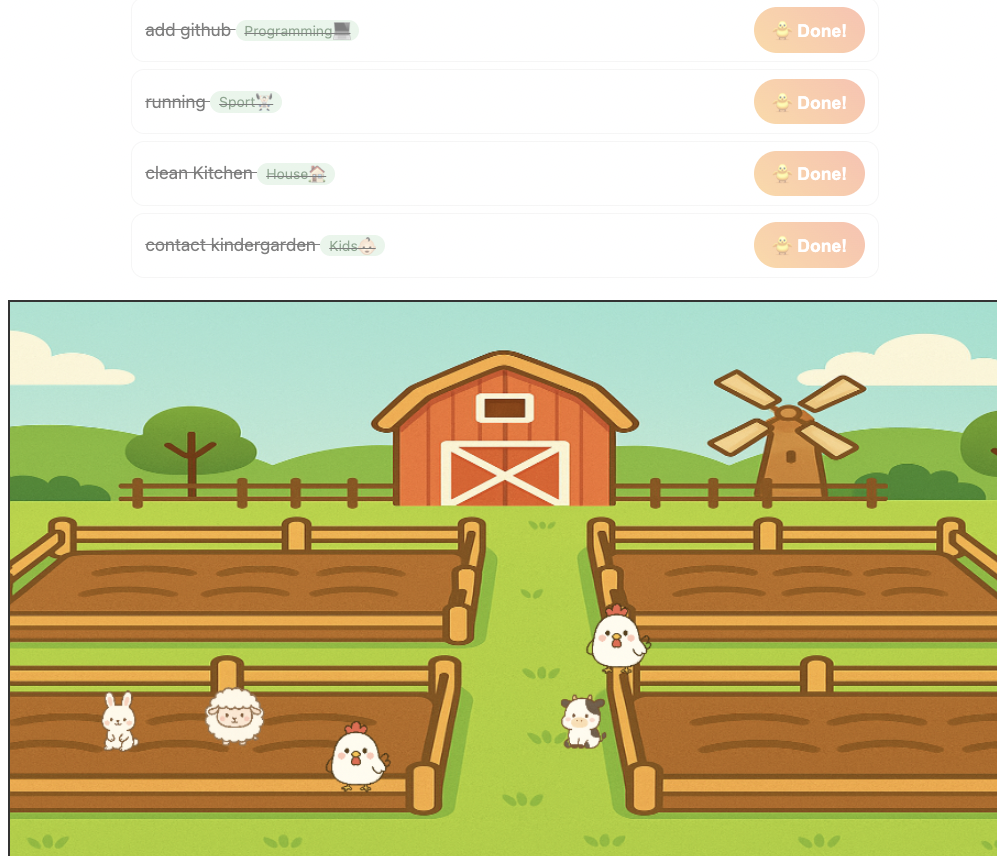

# Farm Todo

A tiny, no-build web app where completing a task spawns a cute animal into one of four plots on a farm.  
Each task category maps to a specific plot/animal:

| Category     | Plot         | Animal |
|--------------|--------------|--------|
| Programming  | Top-left     | 🐔 Chicken |
| Sport        | Top-right    | 🐄 Cow     |
| House        | Bottom-left  | 🐑 Sheep   |
| Kids         | Bottom-right | 🐇 Rabbit  |



## Features
- Add tasks with a category selector
- Click **Done!** → an animal appears in the corresponding plot
- Collision-aware placement inside each plot (no big overlaps)
- Works offline: open `index.html` directly
- Easy to customize (images, categories, plot rectangles)

## Quick Start
1. Clone/download the repo.
2. Open `index.html` in your browser. That’s it.

> Tip: If the background file is `images/fields.png` (or `field.png`), make sure the path in `script.js` matches:
> ```js
> const bg = new Image(); bg.src = "images/fields.png"; // or "field.png"
> ```

## Project Structure
